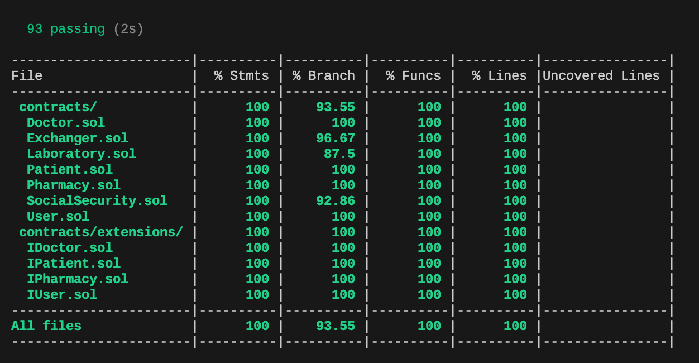
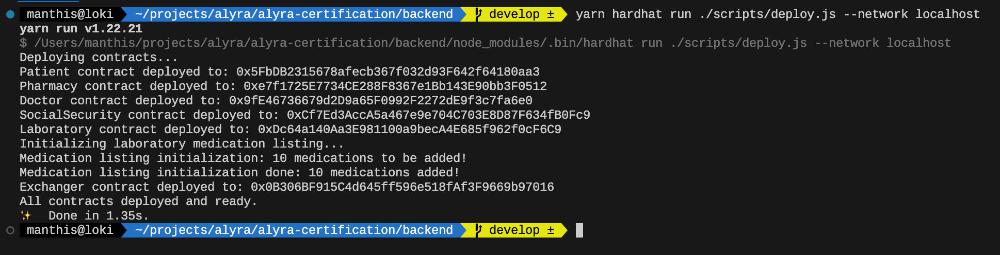
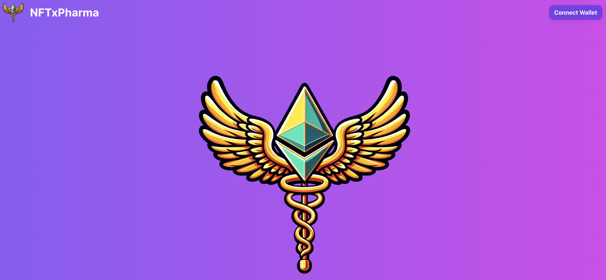

[](https://codecov.io/gh/manthis/NFTxPharma)

# NFTxPharma

## :point_right: Overview

The French prescription and medication dispensing system is outdated and obsolete. As of now, there are numerous issues that need addressing, including:

-   Prescriptions are difficult to read and prone to errors in interpretation.
-   Prescriptions are not secure and incur significant costs due to fraud, loss, or misuse.
-   The French prescription system offers very limited means of traceability.
-   The paper-based prescription system has a negative environmental impact.
-   The prescription system is costly in financial terms and in time.
-   There is no traceability of medication from the laboratory to the patient.
-   Counterfeit medications and prescriptions are a problem.

The goal of NFTxPharma is to modernize this system and provide a decentralized application (dApp) that leverages blockchain technology to solve the aforementioned issues. This technology enables the required traceability and security for such a system. It allows for the digitization of prescriptions and the traceability of medications through these prescriptions.

This is a **proof of concept** and does not take into account security, laws, and current regulations in France but aims to illustrate the potential uses of the Ethereum blockchain to solve these types of problems.

## :point_right: Smart Contracts

### Stack

-   Solidity 0.8.20
-   Hardhat 2.19.5
-   Ethers 6.4.0
-   Chai 4.2.0
-   OpenZeppelin 5.0 contracts

### Contracts

-   **Patient.sol**: handle patients authentication with a merkle tree whitelist
-   **Doctor.sol**: handle doctors authentication with a merkle tree whitelist
-   **Pharmarcy.sol**: handle pharmacies authentication with a merkle tree whitelist
-   **SocialSecurity.sol**: produces NFTxP (Prescription NFTs) for patients. This contract is based on the ERC721 standard, from which some functions have been removed for security reasons.
-   **Laboratory.sol**: produces NFTxM (Medication NFTs) for pharmacies
-   **Exchanger.sol**: enables a secure transaction between the patient, who will pay for their medications in ETH, and the pharmacist, who will in turn deliver the NFTxM (medications). This contract is based on the ERC1155 standard because it allows for a more cost-effective minting of a collection of NFTs, which is often the form that NFTxM take, as they each represent a medication with its own unique properties.

### Tests



### Deployment

Smart contracts can be deployed ether locally on hardhat or on Sepolia. To deploy the smart contracts use the following command:

```
yarn hardhat run ./scripts/deploy --network [network_name]
```



## :point_right: dApp



### 1. Demo

Lien vers la vidéo de démo:

### 2. Overwiew (image et stack)

#### Stack

-   Next.js 14.1.0
-   React 18
-   Wagmi 2
-   Viem 2
-   RaibowKit 2
-   ChackrUI 2.2.0
-   TailwindCSS

### 3. Link to the application

The dApp is hosted on [Vercel](https://vercel.com/). Please click here: [https://nf-tx-pharma.vercel.app/](https://nf-tx-pharma.vercel.app/)
